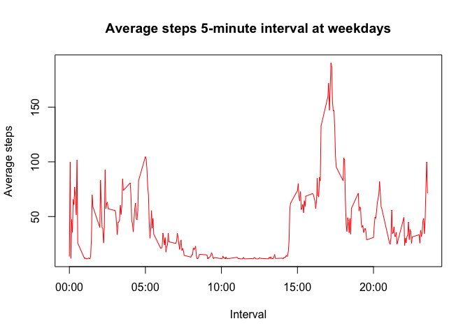

# Reproducible Research: Peer Assessment 1


## Loading and preprocessing the data

Reading the data and sum of steps per day:

```r
activity<- read.csv ("activity.csv")
dailyActivity<- aggregate(steps ~ date, data=activity, sum)
```

Histogram of the daily number of steps:

```r
hist(dailyActivity$steps, main="Histogram of daily activities of steps", ylab="Frequency", xlab="Number of steps")
```

 


## What is mean total number of steps taken per day?
Here is the mean and median of the total number of steps:

```r
mean(dailyActivity$steps)
```

```
## [1] 10766
```

```r
median(dailyActivity$steps)
```

```
## [1] 10765
```


## What is the average daily activity pattern?
Here is the average daily activity pattern:

```r
meanIntervals<- aggregate(steps ~ interval, data=activity, mean)
plot(meanIntervals$steps ~ meanIntervals$interval, type="l", main="Plloting of the number of steps for each interval value", xlab="Intervals", ylab="Number of Steps")
```

 

The Interval number that has the maximum value of steps is 8:35

```r
answer<-subset(meanIntervals, meanIntervals$steps==max(meanIntervals$steps))
answer
```

```
##     interval steps
## 104      835 206.2
```

The number of NA values in steps is 2304

```r
sum(is.na(activity$steps))
```

```
## [1] 2304
```


## Imputing missing values
The strategy that I would recommond to fill the missing values is to have the mean value of the steps. (put 100)

Here is the code that fills the missing valuse to have the mean:

```r
activity2<- activity
#activity2$steps[is.na(activity2$steps)]<- mean(activity2$steps)
activity2$steps[is.na(activity2$steps)]<- 100
```

Histogram of the daily number of steps for activity2:

```r
dailyActivity2<- aggregate(steps ~ date, data=activity2, sum)
hist(dailyActivity2$steps, main="Histogram of daily activities of steps", ylab="Frequency", xlab="Number of steps")
```

 

Here is the mean and median of the total number of steps for activity2:

```r
mean(dailyActivity2$steps)
```

```
## [1] 13131
```

```r
median(dailyActivity2$steps)
```

```
## [1] 11458
```

### The new valuse that are replaced in space of NA values made some difference in the results 
It expands the sum of steps then expands the scale of x axis
Also, it increases the value of mean and median


## Are there differences in activity patterns between weekdays and weekends?

- Classifing the data into weekdays and weekends and do the steps again. 
- Creating a new factor level that has two different values "weekday" and "weekend"
- 

```r
activity$interval <- as.factor(as.character(activity$interval))
intervalMean <- as.numeric(tapply(activity$steps, activity$interval, mean, na.rm = TRUE))
intervals <- data.frame(intervals = as.numeric(levels(activity$interval)), intervalMean)

activity2$day<- c("weekday", "weekday", "weekday", "weekday", "weekday", "weekend", "weekend") [as.POSIXlt(activity2$date)$wday + 1]
weekday <- activity2[activity2$day=="weekday", ]
weekend <- activity2[activity2$day=="weekend", ]
weekdayMean <- as.numeric(tapply(weekday$steps, weekday$interval, mean))
weekendMean <- as.numeric(tapply(weekend$steps, weekend$interval, mean))

intervalsDays <- data.frame(intervals = as.numeric(levels(activity$interval)), weekdayMean, weekendMean)
intervalsDays <- intervalsDays[order(intervalsDays$intervals), ]
```


Preparing the plotting factors and do the plot function two times:

```r
labels <- c("00:00", "05:00", "10:00", "15:00", "20:00")
labels.at <- seq(0, 2000, 500)

plot(intervalsDays$intervals, intervalsDays$weekdayMean, type = "l", col = "red", ylab = "Average steps", xlab = "Interval", main = "Average steps 5-minute interval at weekdays", xaxt = "n")
axis(side = 1, at = labels.at, labels = labels)
```

 

```r
plot(intervalsDays$intervals, intervalsDays$weekendMean, type = "l", ylab = "Average steps", xlab = "Interval", main = "Average steps 5-minute interval at weekends", xaxt = "n")
axis(side = 1, at = labels.at, labels = labels)
```

 

Here is the end of the report...

